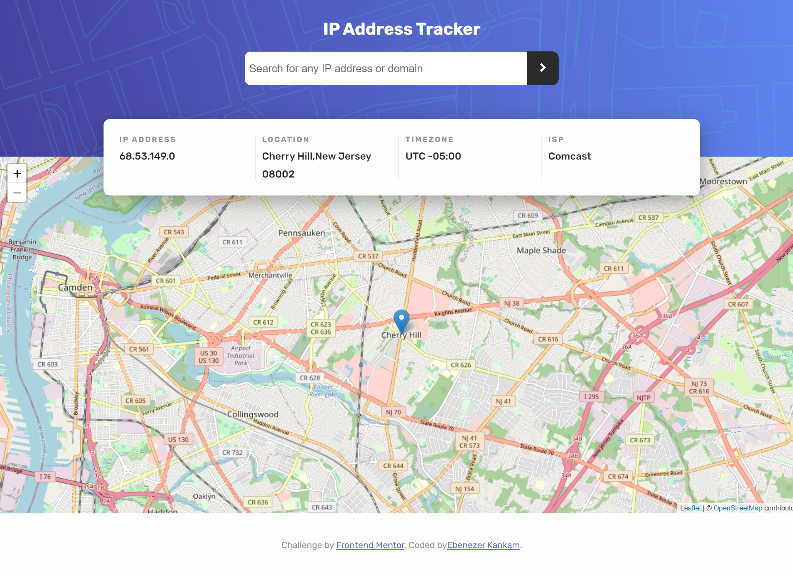

# Frontend Mentor - IP address tracker

## Overview

A react js application that allows the user to search up an ip address and use the geolocation to locate the location of the user. This application uses both the [IP Geolocation API by IPify](https://geo.ipify.org/) to get ip address information and [LeafletJS](https://leafletjs.com/) to display the location of the ip address.

## Installation

You can clone the repo to your local machine and run `npm start` to get the application running.

## Tech Stack

-   ReactJS
-   IP Geolocation API by IPify
-   LeafletJS
-   Sass
